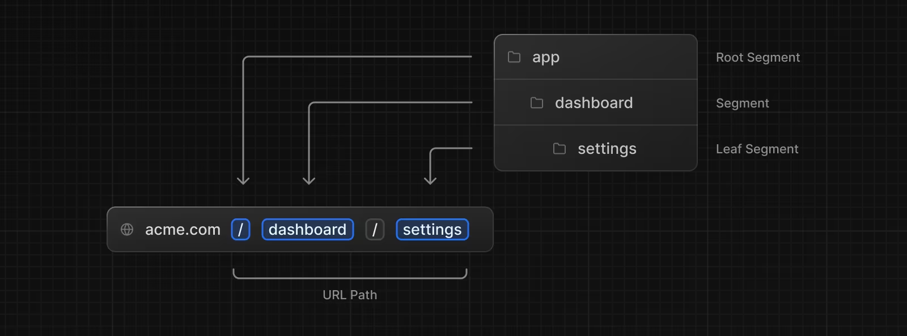

# LiteraLingo

[](https://www.typescriptlang.org/)

## Table of Contents

- [About](#-about)
- [How to Run](#-how-to-run)
- [Documentation](#-documentation)
- [License](#-license)
- [Contact](#%EF%B8%8F-contact)

## ❓ About

**LiteraLingo** is a service designed to provide...

## 📝 How to Run

To run the app, follow these steps:

```shell
# Clone the repository
git clone https://github.com/Angelawork/LiteraLingo_H4I_Project.git

# Navigate to the project directory
cd LiteraLingo_H4I_Project

# Check that Docker is installed
docker -v

# Start the frontend

# Install dependencies and start the dev server
npm i && npm run dev

# Start the backend
# Ensure your PostgreSQL CLI is set up correctly by creating a role, password, and database corresponding to the connection string in env.js (database should be called literalingo, username can be postgres, password can be password123)

# Connect to your database via the CLI with:
psql <your-connection-string-here> OR
psql -U postgres -D literalingo

# Grant permissions to yourself from your superuser:
# example below: if your username is postgres:
GRANT CREATE ON SCHEMA public TO postgres;

# Ensure you can create a table by running:
CREATE TABLE xyz (a VARCHAR(100));

# Verify the table was created with:
\dt

# If successful, delete the table with:
DROP xyz;

# Run the following script to start the containerized backend
./start-database.sh

# Sync up your Prisma schema with your db
npx prisma db push

# Seeding the database
npm run seed

# Testing that the seed worked
npm run seed-test

```

## 📚 Documentation

### How to format your code

Use Prettier for formatting. Default settings are fine

### How to create components

Ensure that your component is declared in the following way for faster TypeScript compilation speeds:

`export const ComponentName: React.FC<ComponentNameProps> = ({ ...props... }) => {}`

### How to organize components

Components and their corresponding styling files are stored in the same directory for ease of use and development under the `src/app/_components` directory

To create a page, create a file called `page.tsx` in a new directory under `src/app`. The name of the folder will correspond to the URL endpoint of the page. For example, if you create a directory called `scr/app/users`, then you access the content of this directory on the browser under `localhost:3000/users`. The newly created `page.tsx` tells Next.js what the main content of the page at that URL will be.



For more information about dynamic page routing, see the [Next.js docs](https://nextjs.org/docs/app/building-your-application/routing/defining-routes)

### Sending HTTP requests from the frontend

View the example file in `src/app/_components/user.tsx` for an example about how you can make an endpoint call from the frontend.
Import the `<LatestUser />` component on some random page and play around.

### Testing your endpoints with Postman

To test an endpoint, send a request to `localhost:3000/api/trpc/{ROUTERNAME}.{ROUTERMETHODNAME}?batch=1&input={...}`

For example, to say hello to a user based on their name, send a GET request to `http://localhost:3000/api/trpc/user.hello?batch=1&input={"0":{"json": {"text": "World"}}}` with no payload body.

To get the latest created user, send a GET request to `http://localhost:3000/api/trpc/user.getLatest?batch=1` <br/>

To create a new user with the properties `name`, `email`, and `password`, send a POST request to `http://localhost:3000/api/trpc/user.create?batch=1` with the payload body `{"0":{"json": {"name": "...","email": "...","password": "..."}}}`.

All `ROUTERNAME`s are specified under `src/server/api/routers` and all `ROUTERMETHODNAME`s can be found under the respective router file (e.g. the `hello`, `create`, and `getLatest` methods in the previous examples can be found in `src/server/api/routers/user.tsx`).

Notice how in a GET request, we send a payload in the URL itself, but in a POST request, it's sent as part of the request's body. <br/>

To learn more, see the [tRPC docs](https://trpc.io/docs/rpc).

## 📃 License

LiteraLingo is licensed under...

## 🗨️ Contact

For more details about our product, service, or any general information regarding LiteraLingo, feel free to reach out to us. We are here to provide support and answer any questions you may have. Below is the best way to contact us:

- **Email**: Send us your inquiries or support requests at...
